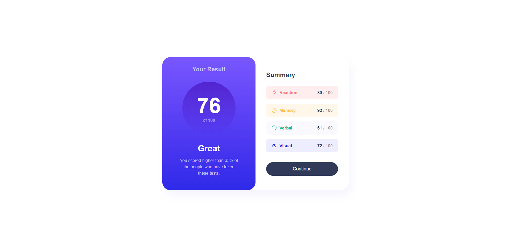
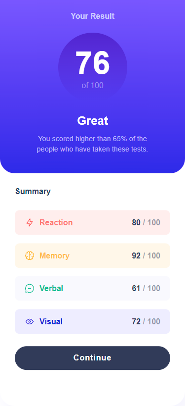

# Frontend Mentor - Results summary component solution

This is a solution to the [Results summary component challenge on Frontend Mentor](https://www.frontendmentor.io/challenges/results-summary-component-CE_K6s0maV). Frontend Mentor challenges help you improve your coding skills by building realistic projects. 

## Table of contents

- [Overview](#overview)
  - [The challenge](#the-challenge)
  - [Screenshot](#screenshot)
  - [Links](#links)
  - [Built with](#built-with)
- [Author](#author)
- [Acknowledgments](#acknowledgments)

## Overview

### The challenge

Users should be able to:

- View the optimal layout for the interface depending on their device's screen size
- See hover and focus states for all interactive elements on the page

### Screenshot

### Links

- Solution URL: [Solution](https://github.com/Elwyn17/result-summary-component-frontendmentor)
- Live Site URL: [Live URL](https://elwyn17.github.io/result-summary-component-frontendmentor/)

## My process

### Built with

- Semantic HTML5 markup
- CSS
- Flexbox
- Desktop-first workflow

## Author

- Github - [Anurag Elwyn Xess](https://github.com/Elwyn17)
- Frontend Mentor - [@Elwyn17](https://www.frontendmentor.io/profile/Elwyn17)
- Twitter - [@Anuelx](https://twitter.com/Anuelx)

